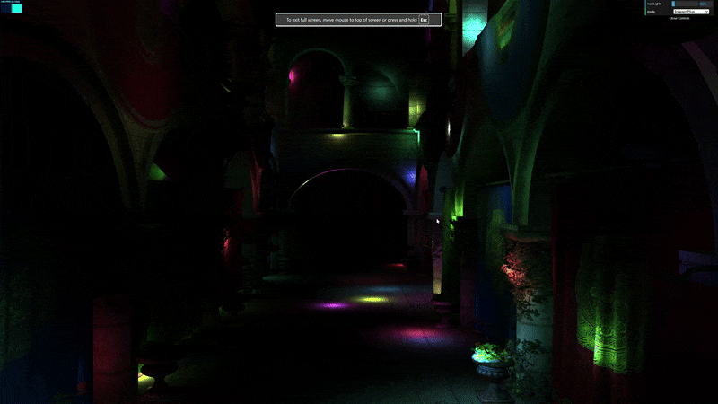

# WebGL Forward+ and Clustered Deferred Shading

## Project Introduction

> University of Pennsylvania CIS5650 – GPU Programming and Architecture
> 
> - Jacky Park
> - Tested on: Windows 11, i9-13900H @ 2.60 32 GB, RTX 4070 (Laptop GPU) 8 GB (Personal Machine: ROG Zephyrus M16 GU604VI_GU604VI)

This project uses WebGPU to implement Naive, Forward+, and Clustered Deferred renderers. 

### Demo Video/GIF

[]

## Algorithm Overview
### Naive Implementation 
The most straightforward implementation. When shading a fragment, we check lighting contribution from every light in the scene. Hence, the frame time scales linearly with the number of lights in the scene. Overall, this approach is simple to understand, but produces poor results in a scene with large numbers of lights.

>#### Time complexity: 
>O(P × L), where P is the number of shaded pixels and L is the number of active lights

### Forward+ Implementation 
Lights have limited range of influence, so why should we check every light in the scene rather than just the ones nearby? This is the intuition that leads us to this optimization: light clustering. To put it simply, the camera’s view frustum is divided into a 3D grid of clusters (X × Y × Z). For each light, we find which clusters it intersects. During shading, each fragment looks up its cluster index and only evaluates the lights affecting that cluster.

This drastically reduces the number of light evaluations per fragment and makes performance scale with visible lights per cluster, rather than total scene lights.

#### Pipeline Summary
1. Compute shader pass: assign lights to clusters (light culling).
2. Forward shading pass: sample the clustered light lists per fragment.
3. Accumulate contributions from only those local lights.

> #### Time complexity: 
> Approximately O(P × L_cluster), where L_cluster ≪ L. Performance improves as clustering density increases.

### Clustered Deffered
Deferred shading further separates lighting from geometry rendering. Instead of shading immediately, the first pass (G-buffer) stores per-pixel data such as **albedo, normal, and world position** into render targets. Then, a fullscreen pass performs lighting by reading the G-buffer and using the clustered light lists computed earlier.

By combining **clustering** (from Forward+) and **deferred shading**, we minimize redundant geometry processing and limit lighting cost to relevant clusters.
#### Pipeline Summary
1. G-buffer pass: store material and geometry information.
2. Clustering compute pass: assign lights to clusters.
3. Deferred lighting pass: shade each pixel using cluster-specific lights and G-buffer data.

> #### Time complexity: 
> O(P × L_cluster), but with reduced overdraw and better GPU cache coherence compared to Forward+.

### Credits

- [Vite](https://vitejs.dev/)
- [loaders.gl](https://loaders.gl/)
- [dat.GUI](https://github.com/dataarts/dat.gui)
- [stats.js](https://github.com/mrdoob/stats.js)
- [wgpu-matrix](https://github.com/greggman/wgpu-matrix)
